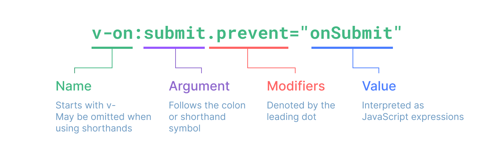
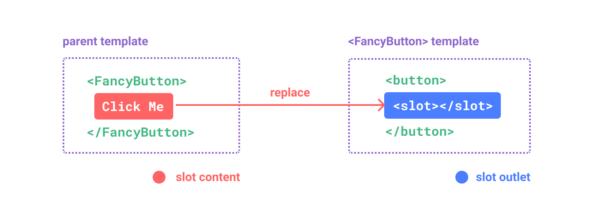
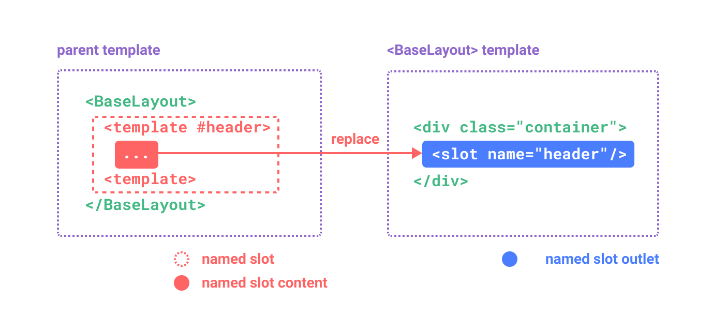
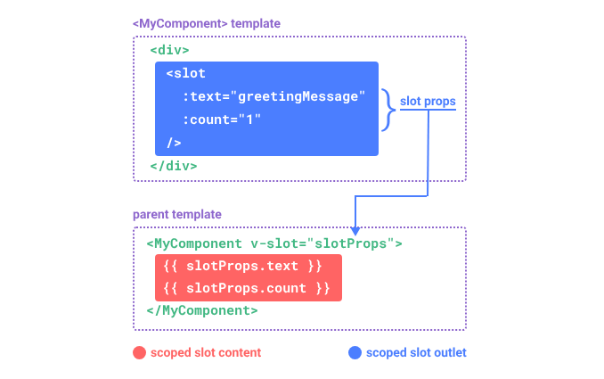

# 从零开始的Vue3(组合式API)

参考[Vue](https://cn.vuejs.org/guide/introduction.html)官方文档

* ### [组件注册](#component-registration)
* ### [模板语法](#template-syntax)
* ### [响应式](#responsive)
* ### [计算属性](#compute-attributes)
* ### [监视属性](#monitor-properties)
* ### [条件渲染](#conditional-rendering)
* ### [列表渲染](#list-rendering)
* ### [事件处理](#event-processing)
* ### [表单输入绑定](#form-input-bindings)
* ### [类与样式绑定](#classes-are-bound-to-styles)
* ### [插槽](#slot)
* ### [动画](#animation)
* ### [路由](#router)
* ### [其他和扩展](#miscellaneous-and-extended)
    * #### [watchEffect](#watch-effect)
    * #### [props](#props-title)
    * #### [pinia](#pinia)
    * #### [自定义事件](#custom-events)
    * #### [$attrs](#attrs-title)
    * #### [$refs和$parent](#refs-and-parent)
    * #### [依赖注入](#dependency-injection)
    * #### [KeepAlive](#keep-alive)
* ### [IDEA项目命令](#idea-directive)

<h2 id="component-registration">组件注册</h2>

> 组件是一个HTML、CSS、JS的代码片段  
> 一个组件使用前要先进行注册否则不生效  
> 组件名推荐首字母大写

### 全局注册

> 全局注册顾名思义,注册全局之后其他注册的组件不导入也可以访问,但是在打包时"tree-shaking"中即使没有使用这个组件也不会去除

```javascript
const app = createApp()
app.component("MyConponent", MyConponent)
```

### 局部注册

> 局部注册相对情况下比全局注册更加实用

```
<script setup>
  import ComponentA from './ComponentA.vue'
</script>
```

<h2 id="template-syntax">模板语法</h2>

### 插值语法

> 模板语法可以将我们声明的变量和方法在HTML中展示,并可以给予响应式来让网页更优雅

```javascript
const name = reactive({
    name: "张三"
})
```

```html

<div>{{name}}</div>

```

### HTML属性 attribute

> 在元素中属性上绑定,可以用来将值放在属性上来进行一些其他的功能  
> 例如v-bind:id="name"来进行绑定属性,绑定时候name的值是js声明中的值

```html

<div v-bind:id="name"></div>

```

> 由于v-bind实在是太实用了,可以用":"来简写v-bind

```html

<div :id="name"></div>

```

### 同名简写v3.4+

> 如果属性内容和属性名一致可以进一步简化语法省略属性值

```
<div :id></div>
```

### 使用JavaScript表达式&调用函数

> 我们可以在绑定的属性中和插值文本中使用JavaScript表达式,但一般不使用,通常来放一个值或方法防止阅读起来困难  
> 也可以在一个插值文本和绑定的属性中调用函数的返回值

```html

<div :id="functionName()">{{functionName()}}</div>

```

### 指令语法&修饰符

> 修饰符是以点开头的特殊后缀,表明指令使用其他的其他的方式绑定



<h2 id="responsive">响应式</h2>

### ref()

> `ref()`是一个响应式对象,用来响应一个基本数据类型也可以传入一个对象,但底层会调用`reactive()`来响应一个对象
> 用`.value`来获取值

```javascript

import {ref} from "vue"

const name = ref("张三")

```

```html
<h1>{{name.value}}</h1>
<button @click="name.value='李四'">点我更改name的值</button>
```

### reactive()

> `reactive()`也是一个响应式函数,但不能传入一个基本数据类型,只能传入对象和数组,而且不用调用烦人的`.value`
> 调用方式为`obj.name`,响应式默认是深层次的即使你在对象里嵌套了很多对象他会检测的到,数组也是

```javascript
const person = reactive({
    name: "张三",
    age: 19
})
```

### setup()

> 组合式API 是新一代的配置项  
> 之前的配置项,方法、属性、计算属性、监视属性代码量一大就很难以阅读,组合式API出现了,你要用什么方法就调用什么方法,每一个不同的逻辑也可以写在hooks文件夹里,每一个hook函数就代表一个信息和逻辑处理,更好维护和阅读

```
setup(props, context){
    return {}
}
```

> 或者在声明script标签中加入setup属性

```
<script setup></script>
```

<h2 id="compute-attributes">计算属性</h2>

> 模板中可以执行的语法虽然方便,如果在模板中写太多逻辑就会导致很臃肿,不易阅读,难以维护,但有了计算属性可以很方便地在模板中写处理逻辑

```javascript
const name = computed(() => {
    return name += "~"
})
```

### 可写计算属性

> 计算属性默认是只读的。当你尝试更改计算属性会收到一个警告需要特定的写法才可以使用可写计算属性

```javascript
const person = ref({
    firstName: "张",
    lastName: "三"
})
const name = computed({
    get() {
        return person.firstName + " " + person.lastName
    },
    set(value) {
        const nameArr = value.split(" ")
        person.firstName = nameArr[0]
        person.lastName = nameArr[1]
    }
})
```

> 通常第一种写法叫做计算属性简写方式

<h2 id="monitor-properties">监视属性</h2>


> 侦听器用于某个属性进行更改时候调用指定的函数来,来完成一些作用  
> 侦听器`watch()`在组合式API中调用它可以创建一个侦听器。由于是监视(侦听)作用它不需要返回值  
> 第一个参数用于传入一个数据源,或者一个多数据源数组,第二个参数就是触发调用的函数,会传入两个值一个新值和旧值,第三个参数是一个配置项

```javascript
const name = ref("张三")
//只要name的内容被更改就会调用传入的函数
watch(name, (newValue, oldValue) => {
    console.log("name被更改了")
})
```

> 传入一个响应式对象默认开启深层监视,对象中的所有属性都会进行监视,可以通过配置项进行更改浅层监视

```javascript
const obj = reactive({
    name: "张三",
    age: 18,
    firends: {
        name: "李四",
        age: 18,
    }
})
watch(obj, () => {
    console.log("obj中的属性值被改变了")
}, {deep: false})
```

### 即使回调侦听器

> 由于数据源是数据更改才执行,可以通过一个配置项来在首次解析模板时调用

```javascript
const name = ref("张三")
watch(name, (newValue, oldValue) => {
    console.log("函数执行了")
}, {immediate: true})
```

### 一次性监听器v3.4+

> 如果只希望调用一次函数可以用once配置项

```javascript
const name = ref("张三")
watch(name, callBack, {once: true})
```

<h2 id="conditional-rendering">条件渲染</h2>

### v-if

> v-if指令在返回一个真才会进行渲染

```html

<div v-if="true">我是ture</div>

```

### v-else

> v-else必须上个元素是v-if或v-if-else。如果v-if不渲染将渲染v-else

```html

<div v-if="true">我是ture</div>
<div v-else>我是false</div>

```

### v-else-if

> 顾名思义可以绑定多个v-else-if,也需要紧跟v-if、v-else-if之后

```html

<div v-if="false">我是false</div>
<div v-else-if="false">我是false</div>
<div v-else>我是true</div>
```

### v-show

> 另一个展示元素的方法,但是并不是直接删除节点而是将节点CSS属性设置`display:none`

```html

<div v-show="true">hello</div>

```

### v-show 和 v-if

> v-if在值更改时,其会被销毁和重建的,如果显示和隐藏比较频繁更推荐使用v-show

<h2 id="list-rendering">列表渲染</h2>

> 在Vue中可以通过v-for来渲染一个列表,通过item in items语法使用,最好使用:key指令搭配,:key是Vue内部维护的一个属性

```html

<div v-for="item in items" :key="item.id"></div>

```

<h2 id="event-processing">事件处理</h2>

> 事件是js中较为常用的交互之一,我们可以在Vue中使用`v-on:click="function"`来进行一个事件绑定。如果`@click`
> 的值是一个函数并且有参数,可以用`$event`进行占位,拿到event。
> 由于过于常用可以使用@作为简写符号`@click="function"`

```javascript
const funcitonName = function () {
    console.log("我被点击了")
}
```

```html

<div @click="functionName">点我</div>

```

### 事件修饰符

> 我们使用键盘事件有时会使用`event.preventDefault()`,Vue为v-on提供了事件修饰符  
> 以下这些既是

#### .stop

#### .prevent

#### .self

#### .capture

#### .once

#### .passive

> 以下摘自Vue官方文档

```html
<!-- 单击事件将停止传递 -->
<a @click.stop="doThis"></a>

<!-- 提交事件将不再重新加载页面 -->
<form @submit.prevent="onSubmit"></form>

<!-- 修饰语可以使用链式书写 -->
<a @click.stop.prevent="doThat"></a>

<!-- 也可以只有修饰符 -->
<form @submit.prevent></form>

<!-- 仅当 event.target 是元素本身时才会触发事件处理器 -->
<!-- 例如：事件处理器不来自子元素 -->
<div @click.self="doThat">...</div>

<!-- 添加事件监听器时，使用 `capture` 捕获模式 -->
<!-- 例如：指向内部元素的事件，在被内部元素处理前，先被外部处理 -->
<div @click.capture="doThis">...</div>

<!-- 点击事件最多被触发一次 -->
<a @click.once="doThis"></a>

<!-- 滚动事件的默认行为 (scrolling) 将立即发生而非等待 `onScroll` 完成 -->
<!-- 以防其中包含 `event.preventDefault()` -->
<div @scroll.passive="onScroll">...</div>
```

### 按键修饰符

> 写一些很常用的按键时比较繁琐,Vue已经写好了部分按键,语法是@事件名.按键别名

```html

<input type="text" @keydown.enter="function">

```

```
.enter
.tab
.delete
.esc
.space
.up
.down
.left
.right
```

### 系统按键修饰符

> 按下系统修饰符后,再按下其他按键触发。可以使用.exact来单独触发系统修饰符

```html

<div @keydown.ctrl.exact="function"></div>

```

```
.ctrl
.alt
.shift
.meta
```

### 鼠标按键修饰符

> 由鼠标触发的按键修饰符

```
.left
.right
.middle
```

<h2 id="form-input-bindings">表单输入绑定</h2>

> 在前端中获取输入值,Vue提供了一个指令`v-model`可以动态的获取表单中的值

```html

<input type="text" v-model="value">

```

### 基本用法

> 将输入的值显示在p标签中

```html
<p>{{text}}</p>
<input type="text" v-model="text">
```

### 复选框

> 绑定一个布尔类型,`booleanName`获取的是一个布尔类型,如果是多个复选框可以绑定到一个数组

```html
<input type="text" v-model="booleanName">
```

### 单选按钮

> 通过value传值,绑定并全部绑定一个值

```javascript
const radioValue = ref("")
```

```html

<div>radioValue:{{radioValue}}</div>
<input type="radio" value="one" v-model="radioValue"> One
<input type="radio" value="tow" v-model="radioValue"> Tow

```

### 选择器

> 将option中的值传输给绑定的值,多选(`multiple`)时候可以选择数组

```html

<div>selectValue:{{selectValue}}}</div>
<select v-model="selectValue">
    <option disabled value="">请选择</option>
    <option>A</option>
    <option>B</option>
    <option>C</option>
</select>

```

### 修饰符

#### .lazy

> (官网说法)默认情况下，v-model 会在每次 input 事件后更新数据 (IME 拼字阶段的状态例外)。你可以添加 lazy 修饰符来改为在每次
> change
> 事件后更新数据：

```html
<!-- 在 "change" 事件后同步更新而不是 "input" -->
<input v-model.lazy="msg"/>
```

#### .number

> 将输入的值转换为number如果不能转换将是原值

```html
<input v-model.number="value"/>
```

#### .trim

> 输入的值将去除前后的空格

```html

<input v-model.trim="value"/>

```

<h2 id="classes-are-bound-to-styles">类与样式绑定</h2>

### 类名绑定

> 可以通过`:class`属性进行绑定可以通过对象里面的布尔值来进行是否渲染在文档中

```javascript
const isActive = ref(false)
```

```html

<div class="static" :class="{active:isActive}"></div>

```

> 渲染结果是 `<div class="static"></div>` 由于isActive是false所以并没有渲染active类名  
> 但是如果active的值进行改变,vue会重新解析模板所以会更新存在,也可以使用对象的方式传入

```javascript
const obj = reactive({
    active: true,
    static: false
})
```

```html

<div :class="obj"></div>

```

> 可以通过数组来给`:class`进行绑定多个样式

```javascript
const activeClass = ref("active")
const errorClass = ref("error") 
```

```html

<div :class="[activeClass,errorClass]"></div>

```

### 样式绑定

> 绑定style样式用:style进行对元素的样式绑定,通过传入对象的方式绑定style对应的值

```html

<div :style="{'fontSize':value+'px'}"></div>

```

> 通过传入对象的方式可以更直观达到想要的效果,在属性中使用太多了逻辑会导致代码臃肿

```javascript
const obj = reactive({
    fontSize: '20px',
    color: 'red'
})
```

```html

<div :style="obj"></div>

```

> 如果想要多个值也可以通过绑定数组的方式来进行多绑定。通过数组的方式会展开数组中的样式内容

```html

<div :style="[obj1,obj2]"></div>

```

<h2 id="slot">插槽</h2>

> 插槽是一个将节点内容传入到子组件的一种传输方式,需要一个入口和出口进行配对



#### 父

```html

<Child>嗨~</Child>

```

#### 子

```html

<template>
    <!--通过slot标签来确定插槽，父节点传进来的节点将替换slot标签-->
    <slot></slot>
</template>

```

### 具名插槽

> 具名插槽在原插槽的上添加了`name`属性,`name="header"`可以让传入进来的节点进行名字配对



#### 父

```html

<Child>
    <template v-slot:header>
        我配对header的插槽
    </template>
    <!--v-slot有简便写法就是#-->
    <template #footer>
        我配对footer的插槽
    </template>
</Child>

```

#### 子

```html

<template>
    <slot name="header"></slot>
    <slot name="footer"></slot>
</template>

```

### 作用域插槽

> 默认插槽和具名插槽都不方便传输数据,作用域插槽可以,让子组件给父组件传输。和具名插槽不一样的是具名插槽是用
> `v-slot:value`,而作用域插槽是用`v-slot="props"`。



#### 父

```html

<Child>
    <template v-slot="props">
        <div>{{props.text}}</div>
    </template>
</Child>

```

#### 子

```html

<template>
    <slot text="嗨~"></slot>
</template>

```

<h2 id="animation">动画</h2>

> 在Vue中使用动画需要一个特殊的标签`<Transition>`,在这个标签中只能有一个根标签,
> 如果有多个标签需要使用`<TransitionGroup>`。工作原理是当选中的元素,隐藏或显示时给予特定了类用来显示或者隐藏元素的动画,
> 在触发动画时会绑定几个class类名分别是`v-enter-active`、`v-leave-active`、`v-enter-from`、`v-enter-to`、
> `v-leave-from`、`v-leave-to`,
> 这些类名分别都是进入和离开所绑定的类名。

### Transition

> Transition只能控制一个元素

#### transition实现

```html

<script setup>
    import {ref} from "vue";

    const isShow = ref(true)
</script>

<template>
    <transition>
        <div v-show="isShow">Text</div>
    </transition>
    <button @click="isShow = !isShow">点我显示或隐藏Text</button>
</template>

<style scoped>
    .v-enter-active, .v-leave-active {
        transition: opacity .5s;
    }

    .v-enter-from, .v-leave-to {
        opacity: 0;
    }
</style>

```

#### animation实现

```html

<script setup>
    import {ref} from "vue";

    const isShow = ref(true)
</script>

<template>
    <transition>
        <div v-show="isShow">Text</div>
    </transition>
    <button @click="isShow = !isShow">点我显示或隐藏Text</button>
</template>

<style scoped>
    .v-enter-active {
        animation: text-animation 1s;
    }

    .v-leave-active {
        animation: text-animation 1s reverse;
    }

    @keyframes text-animation {
        from {
            opacity: 0;
        }
        to {
            opacity: 1;
        }
    }
</style>

```

> 可以给类名中的v通过`names="text-show"`属性起别名,这样就可以区分不同的动画

```html

<transition name="text-show">
    ...
</transition>

<style scoped>
    .text-show-enter-from {
    }
</style>

```

### TransitionGroup

> TransitionGroup可以控制一个列表,几乎和Transition一样的操作,但是使用v-for时要加入key属性让Vue进行维护内部

```html

<script setup>
    import {reactive} from "vue";

    const items = reactive(["zs", "ls", "ww"])

    function addItem() {
        items.unshift("hh")
    }

    function removeItem() {
        items.shift()
    }
</script>

<template>
    <transition-group class="container">
        <div v-for="i in items" :key="i">{{ i }}</div>
        <button @click="addItem">点我添加一个</button>
        <button @click="removeItem">点我删除一个</button>
    </transition-group>
</template>

<style scoped>
    .v-enter-active, .v-leave-active, .v-move {
        transition: all 0.5s;
    }

    .v-enter-from, .v-leave-to {
        opacity: 0;
        transform: translateY(-30px);
    }

    .v-leave-active { /*删除元素时更好的有一个过渡动画*/
        position: absolute;
    }
</style>
```

<h2 id="router">路由</h2>

<h2 id="miscellaneous-and-extended">其他和扩展</h2>

> 这里是一些其他的API和一些基于Vue的库

<h3 id="watch-effect">watchEffect</h3>


> `watchEffect()`是一个监视的函数,它可以不让你传入依赖项,直接监视回调函数中使用过的值,对比watch会更加方便些

```javascript
const name = ref("张三")
const age = ref("18")

watchEffect(() => {
    if (name.value != "张三" || age.value != 18) {
        console.log("我被更改了")
    }
})
```

> 对比`watch()`函数

```javascript
const name = ref("张三")
const age = ref("18")

watch([name, age], (value) => {
    let [newName, newAge] = value
    if (newName != "张三" || newAge != 18) {
        console.log("我被更改了")
    }
})
```

<h3 id="props-title">Props</h3>


> props用于传输父给子传输数据,是很方便的一种数据传输通过`defineProps()`。传入的属性名要和参数名字相同  
> 也可以传入一个函数让子将参数传入完成子给父传  
> 如果一个prop文件名字过长请使用camelCase格式,在模板中可以使用kebab-case格式  
> 注意!props是只读的

```html

<Component :mes-title="value"></Component>

```

```html

<script setup>
    const props = defineProps(["mesTitle"])
</script>

```

> props还可以传入一个配置对象,可以配置每个参数的数据类型

```html

<script setip>
    const props = defineProps({
        mesTitle: String,
        // 不确定也可以使用数组的方式
        // mesTitle: [String,Number]
        // 是否为必传
        // title: {
        //     type: [String, null],
        //     required: true
        // },
    })
</script>

```

<h3 id="pinia">Pinia</h3>


> pinia是一个符合直觉的状态管理工具,用于集中式管理数据

#### 引入

```javascript
import {createApp} from "vue"
import {createPinia} from "pinia"

const app = createApp()
app.use(createPinia())
```

#### 配置

> 数据文件通常配置在src下的store文件夹,导入`defineStore`函数要传入两个配置项,一个是ID,一个是配置项  
> 一共有三个配置属性分别是`action`、`state`、`getters`。action是做一些逻辑处理,state就是状态数据了,getter是加工之后的state
> action函数的参数会有一个参数是调用传进来的参数  
> state的属性必须是一个返回对象的函数
> getters要返回一个值,pinia给getter方法传入了一个state,可以直接拿到state的数据

```javascript
import {defineStore} from "pinia"

export default defineStore("count", {
    action: {},
    state() {
        return {}
    },
    getters: {}
})
```

#### 使用

```html

<script setup>
    import countStore from "@/store/count.js"

    const count = countStore()
</script>

<template>
    <div>{{count.value}}</div>
</template>
```

#### storeToRefs

> 我们在调用state数据时都需要使用`.value`这样显得很烦人有了storeToRefs就方便许多了,这样就可以直接使用`vaule`了

```javascript
import {storeToRefs} from "pinia"

const {value1, valye2} = storeToRefs(count)
```

```html

<div>{{value1}}</div>

```

#### subscribe

> 类似监视属性,调用的store的数据一发生改变就会触发一个回调函数。回调传入两个值分别是`mutate`、`state`

```javascript
count.subscribe((mutate, state) => {
    console.log("我的值改变了")
})
``` 

<h3 id="custom-events">自定义事件</h3>


> 自定义事件比起props更适合用于子给父传,通过父组件添加`@自定义事件名`
> 属性,然后子再接收事件名并返回一个对象,通过对象就可以触发函数。
> 触发的函数可以传参数,从而达到子给父传

#### 父组件

```html

<Child @print="callBack"></Child>

```

#### 子组件

```html

<script setup>
    const emits = defineEmits(["print"]);
    //通过emits函数触发，第一个是触发的事件名，第二个是值
    emits("print", value)
</script>

```

<h3 id="attrs-title">$attrs</h3>

> `$attrs`主要作用于祖给后台传,而且给后代传的过程中不需要经过中间人进行传,直接传入到后代组件  
> 其实没有声明props也能收到值,但是存放在`$attrs`中

#### 祖

```html

<A :count="value"></A>

```

#### 父

```html

<B :count="$attrs"></B>

```

#### 子

```javascript
const props = defineProps(["count"]);
```

<h3 id="refs-and-parent">$refs和$parent</h3>


> 通过`defineExpose({})`暴露,子或父的数据就可以在对方传递,注意的是$refs和$parent都是通过模板进行传输的,因为在Vue3中并没有this

#### refs

###### 父

```html

<Child ref="child"></Child>>
<button @click="getRefs($refs)"></button>

```

###### 子

```javascript
const count = ref(1)
defineExpose({count})
```

#### parent

###### 父

```javascript
const count = ref(1)
defineExpose({count})
```

###### 子

```html

<button @click="getParent($parent)"></button>

```

<h3 id="dependency-injection">依赖注入</h3>


> 在用props给后代传输时,中间组件并不需要props的值导致显得很多余, 依赖和注入可以完美适用此时机,通过`provide("key",值)`
> ,再通过`inject("key")`接收,如果传入的是一个响应式对象,这可以通过对象直接进行响应式

#### 父

```javascript
const value = ref("0")
provide("value1", value)
```

#### 子

```javascript
const value = inject("value")
```

<h3 id="keep-alive">KeepAlive</h3>


> 当你销毁组件时，表单中的内容会消失，这导致输入过的内容一切换路由就无法保存，但是`KeepAlive`
> 可以让组件保持存在不销毁，这样即使你切换组件也不会丢失输入的内容。通过KeepAlive进行包裹不被销毁的内容

```html

<KeepAlive>
    <Component></Component>
</KeepAlive>

```

<h2 id="idea-directive">IDEA项目命令</h2>

## Project setup

```

npm install

```

### Compiles and hot-reloads for development

```

npm run serve

```

### Compiles and minifies for production

```

npm run build

```

### Lints and fixes files

```

npm run lint

```

### Customize configuration

See [Configuration Reference](https://cli.vuejs.org/config/).
